## Nama : Yisha Zukhrufin A
## Kelas : TI-3A
## Absen : 29
## Nim : 2141720013

# Pertemuan 12 - Pemograman Asynschronoud

## Praktikum 1: Mengundu Data dari Web Service (API)

### Langkah 1 : Buat Project Baru
Tambahkan dependensi dengan mengetik perintah di bawah

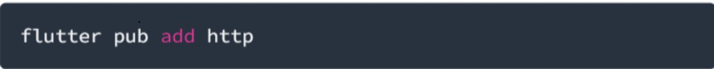

### Langkah 2 : Cek file pubspec.yaml

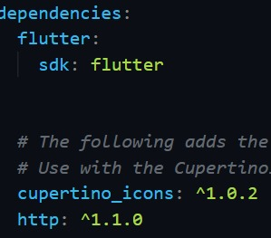

### Langkah 3 : Buka file main.dart

1. Soal 1 : Tambhakan nama panggilan pada title

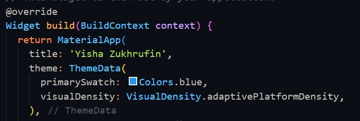

### Langkah 4 : Tambah method getData()
2. Soal 2 : Carilah judul buku favorit Anda di Google Books, lalu ganti ID buku pada variabel path di kode tersebut. Caranya ambil di URL browser Anda seperti gambar berikut ini. dan coba akses

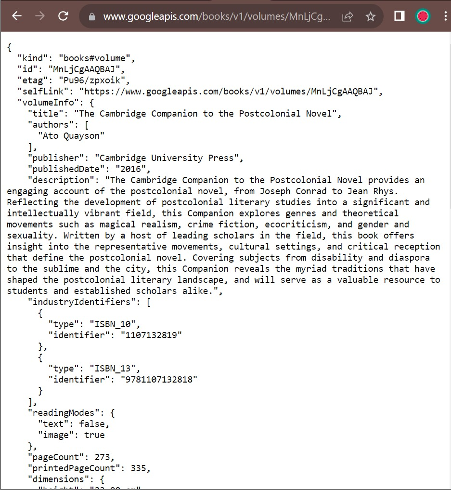

### Langkah 5 : Tambah kode di ElevatedButton
3. Soal 3 : Jelaskan maksud kode langkah 5 tersebut terkait substring dan catchError!
#### Jawab :
=> Substring, menggunakan sebstring (0, 450) untuk mengambil 0 hingga 499 karakter pertama string.
=> catchError, untuk emnangkap error mungkin terjadi selama peroprasian yang akan di result diatur sebagai 'An error occurred'

### Hasil 

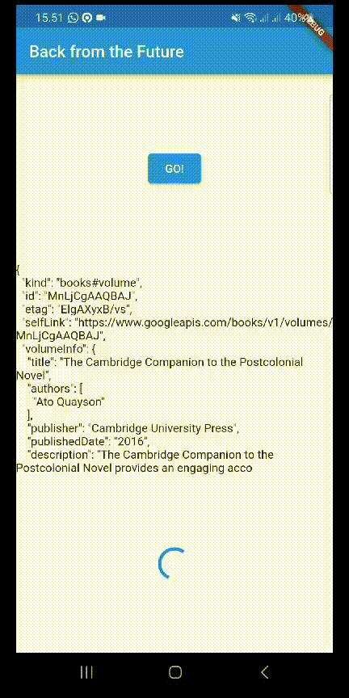

## Praktikum 2: Menggunakan await/async untuk menghindari callbacks

### Langkah 1 : Buka file main.dart

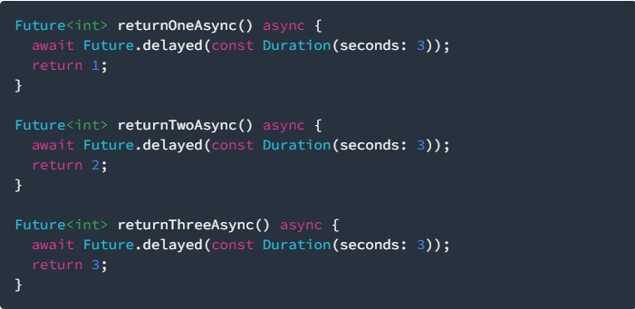

### Langkah 2 : Tambah method count()

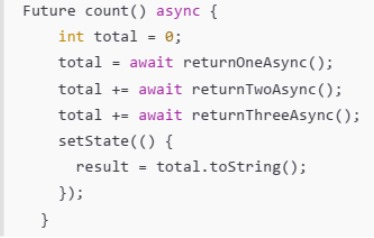

### Langkah 3 : Panggil count()

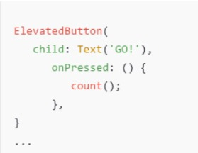

### Langkah 4 : Run

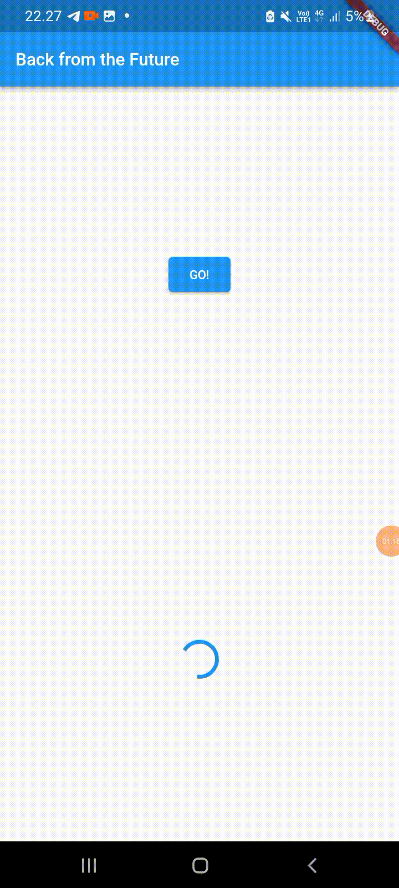

4. Soal 4 : Jelaskan maksud kode langkah 1 dan 2 

#### Jawab :
=> langkah 1, menggunakan tiga fungsi return asinkron(returnOneAsync-returnThreeAsync) yang emngambil niai setelah penundaan 3 detik
=> langkah 2, menggunakan fungsi asinkron 'count', dimana mengumpulkan hasil panggilan tiga fungsi asinkron sebelum mengupdate state(result).

## Praktikum 3: Menggunakan Completer di Future

### Langkah 1 : Buka main.dart

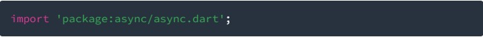

### Langkah 2 : Tambahkan variabel dan method 

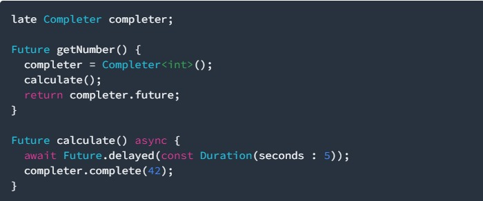

### Langkah 3 : Ganti isi kode onPressed()

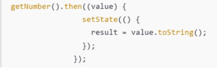

### Langkah 4 : Run

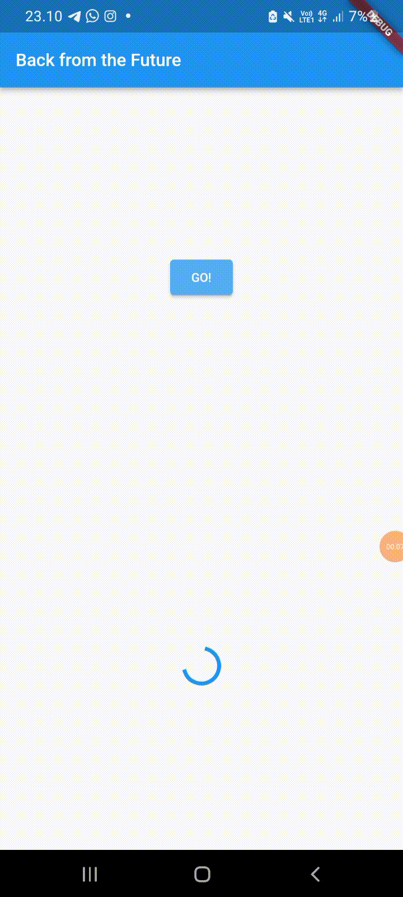

5. Soal 5 : Jelaskan maksud kode langkah 2

#### Jawab :
=> menggunakan objek Comleter
=> mengganti operasi asinkron
=> dalam 'getNumber' Completer iinisialisasi dengan fungsi
=> Calculate fungsi dari asinkron untuk menunda eksekusi selama 5 detik senelum mengisi nilai 42 ke dalam 'completer'
=> getNumber berguna mengembalikan objek 'Future' dari completer

### Langkah 5 : Ganti method calculate()

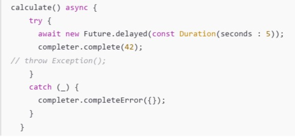

### Langkah 6 : Pindah ke onPressed()

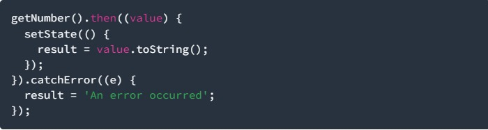

6. Soal 6 : Jelaskan maksud perbedaan kode langkah 2 dengan langkah 5-6 tersebut!

#### Jawab : 
=> menggunakan try-catch, memberi lapisan pelindung untuk kemungkinan error selama penundaan
=> tanpa try-catch, lebih simple dan tidak eksplisit memangani potensi error

## Praktikum 4: Memanggil Future secara pararel

### Langkah 1 : Buka file main.dart

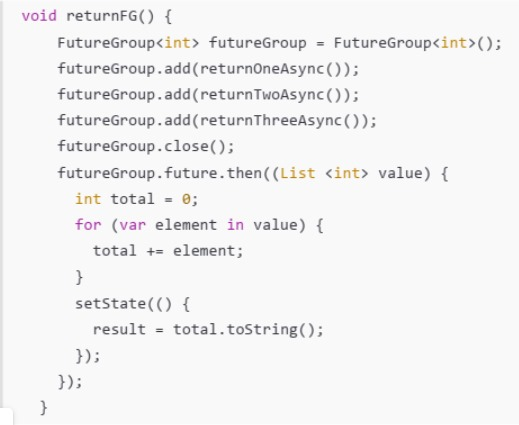

### Langkah 2 : Edit onPressed()

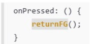

### Langkah 3 : Run

7. Soal 7 : Capture hasil praktikum Anda berupa GIF dan lampirkan di README. 

### Langkah 4 : Ganti variabel futureGroup

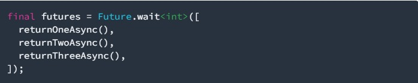

8. Soal 8 : Jelaskan maksud perbedaan kode langkah 1 dan 4!

#### Jawab : 
Perbedaan ada pada pendekatan penanganan dan penungguan kelompok future.
=> langkah 1 : menggunakan objek FutureGroup
=> langkah 4 : menerapkan Future.wait untuk mengatasi beberapa Future secara bersamaan

## Praktikum 5: Menangani Respon Error pada Async Code

### Langkah 1 : Buka file main.dart

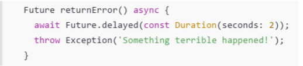

### Langkah 2 : ElevatedButton

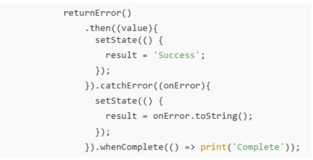

### Langkah 3 : Run

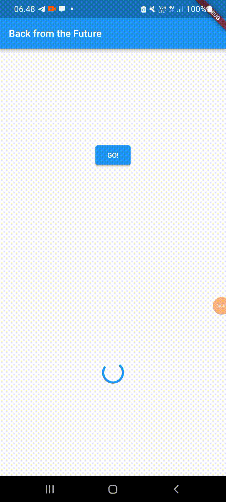

9. Soal 9 : Capture hasil praktikum Anda berupa GIF dan lampirkan di README

### Langkah 4 : Tambah method handleError()

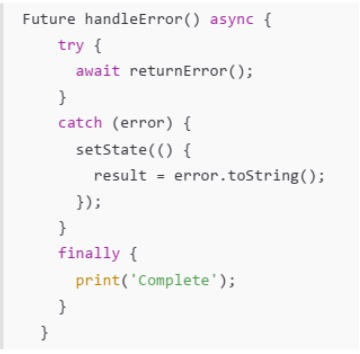

10. Soal 10 : Panggil method handleError() tersebut di ElevatedButton, lalu run. Apa hasilnya? Jelaskan perbedaan kode langkah 1 dan 4!

#### Jawab :
=> langkah 1, fungsi returnError untuk melempar error tanpa menangkapnya secara langsung 
=> langkah 2, fungsi handleError memanggil fungsi returnError dalam blok try.

## Praktikum 6: Menggunakan Future dengan StatefulWidget

### Langkah 1 : install plugin geolocator

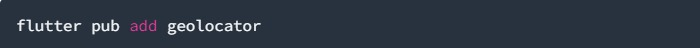

### Langkah 2 : Tambahkan permission GPS

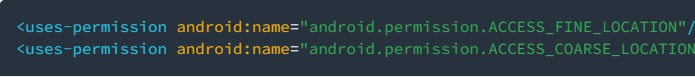

### Langkah 3 : Buat file geolocation.dart

### Langkah 4 : Buat StatefulWidget

### Langkah 5 : Isi kode geolocation.dart

11. Soal 11 : Tambahkan nama panggilan Anda pada tiap properti title sebagai identitas pekerjaan Anda.

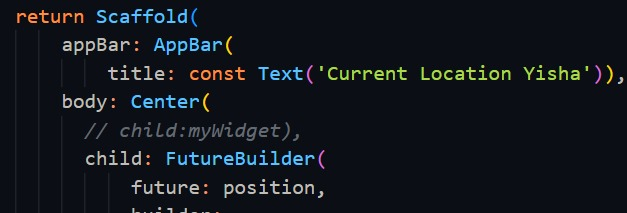

### Langkah 6 : Edit main.dart

### Langkah 7 : Run

### Langkah 8 : Tambahkan animasi loading

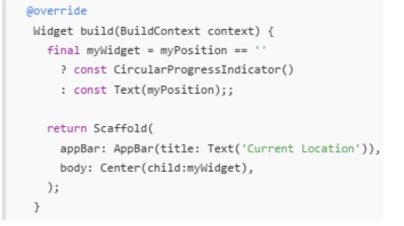

12. Soal 12 : Apakah Anda mendapatkan koordinat GPS ketika run di browser? Mengapa demikian?

#### Jawab :
Jika dijalankan di browser, Flutter web masih dapat menakses atau mendapatkan koordinasi GPS karena menggunakan API Geolocation dari browser langusng.

## Praktikum 7: Menggunakan Future dengan StatefulWidget

### Langkah 1 : Modifikasi method getPosition()

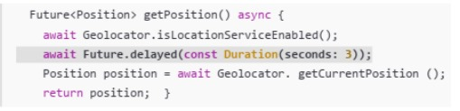

### Langkah 2 : Tambah Variabel

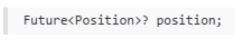

### Langkah 3 : Tambah iniState()

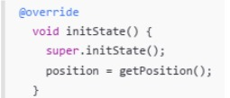

### Langkah 4 : Edit method build()

13. soal 13 : Apakah ada perbedaan UI dengan praktikum sebelumnya? Mengapa demikian?

#### Jawab :
Kedua praktikum tersebut tidak memiliki perbedaan pada antarmuka pengguna (UI). Keduanya menampilkan koordinat geolokasi dengan tata letak yang identik. Kesamaan ini disebabkan oleh pengambilan lokasi yang masih bersifat sinkron di dalam blok initState pada kedua praktikum. Waktu tampilan UI pada keduanya juga mengalami delay yang sama, yaitu 3 detik. Selain itu, tampilan UI dapat tampak seragam karena FutureBuilder secara otomatis mengelola pembaruan UI, bahkan tanpa perlu pemanggilan setState secara langsung.

### Langkah 5 : Tambah handling error

14. Soal 14 : 
Apakah ada perbedaan UI dengan langkah sebelumnya? Mengapa demikian?

#### Jawab :
Tidak ada perbedaan, hanya saja menambahakn kode program errorhandling, yang jika terjadi kesalahan dan akan menampilkan teks kesalahan. Tetapi pada pada praktikum ini tidak terjadi error

## Praktikum 8: Menggunakan Future dengan StatefulWidget

### Langkah 1 : Buat file baru navigation_first.dart

### Langkah 2 : Isi kode navigation_first.dart
15. Soal 15 : 

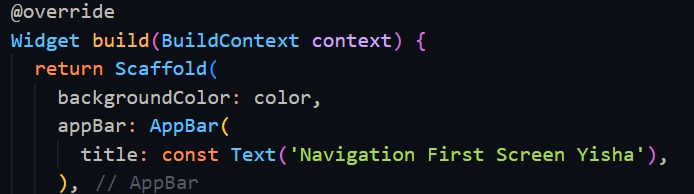

### Langkah 3 : Tambah method di class _NavigationFirstState

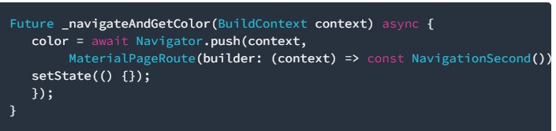

### Langkah 4 : Buat file baru navigation_second.dart

### Langkah 5 : Buat class NavigationSecond dengan StatefulWidget

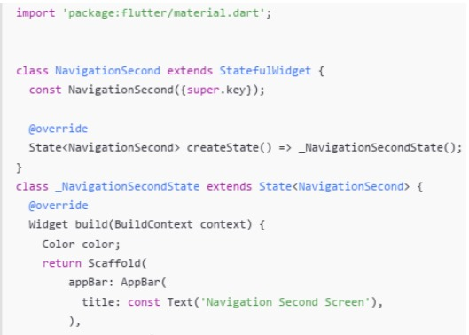

### Langkah 6 : Edit main.dart

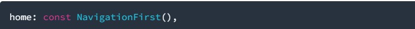

### Langkah 7 : Run

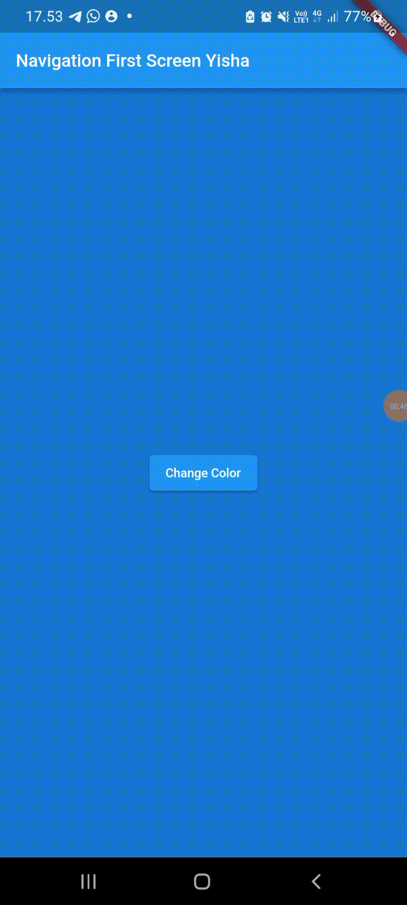

16. Soal 16 : Cobalah klik setiap button, apa yang terjadi ? Mengapa demikian ?

#### Jawab : 
Ketika tombol button diklik, warnanya akan berubah sesuai dengan konfigurasi yang telah ditetapkan dalam ElevatedButton() di dalam kelas navigation_second.dart. Perubahan warna ini karena terdapat fungsi Navigation.pop() pada setiap tombol, dengan parameter berupa konteks dan warna yang telah ditentukan sebelumnya. Jadi, jika masing-masing tombol diklik, warna yang ditampilkan akan bervariasi sesuai dengan nilai variabel color yang telah diatur sebelumnya.

## Praktikum 9: Memanfaatkan async/await dengan Widget Dialog

### Langkah 1 : Buat file baru navigation_dialog.dart

### Langkah 2 : Isi kode navigation_dialog.dart

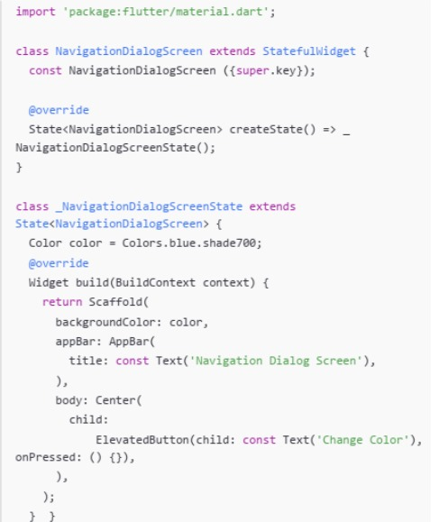

### Langkah 3 : Tambah method async

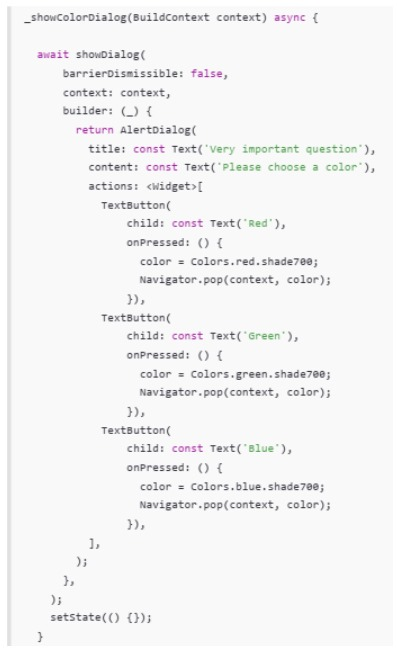

### Langkah 4 : Panggil method di ElevatedButton

### Langkah 5 : Edit main,dart

### Langkah 6 : Run

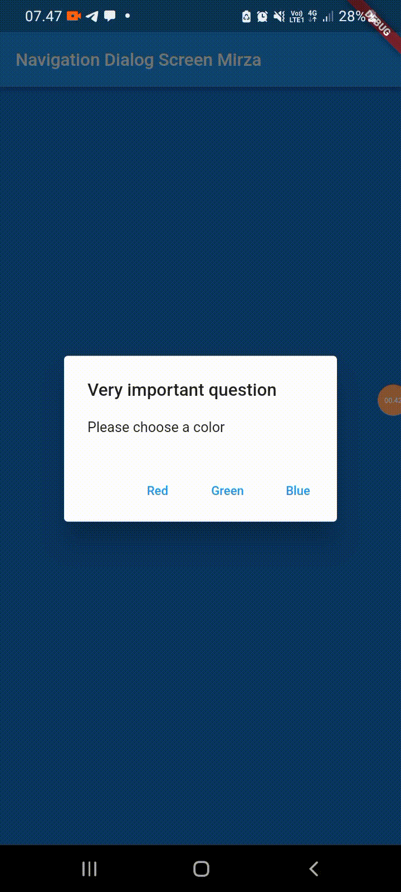

17. Soal 17 : Cobalah klik setiap button, apa yang terjadi ? Mengapa demikian ?

#### Jawab :
Ketika tombol "changecolor" ditekan, muncul alert/dialog yang memungkinkan pengguna memilih warna untuk mengubah latar belakang. Proses ini terjadi karena nilai warna diperbarui dengan nilai yang dipilih dalam fungsi _showColorDialog, dan setelah itu, widget diperbarui dengan menggunakan setState. Hal ini mengakibatkan pembangunan kembali widget dan menampilkan perubahan warna pada layar.

